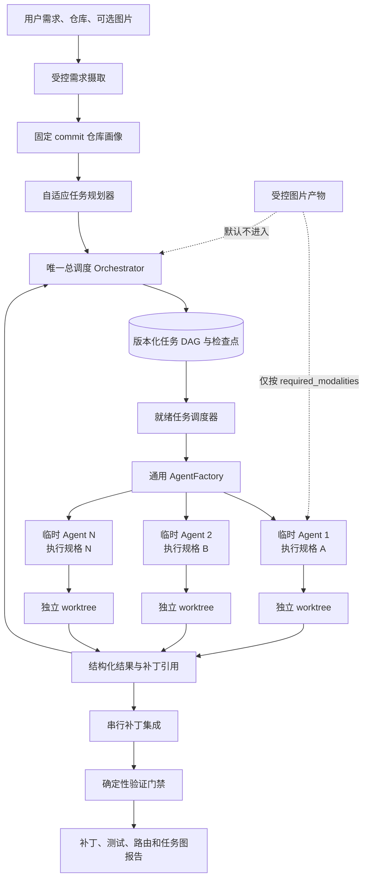
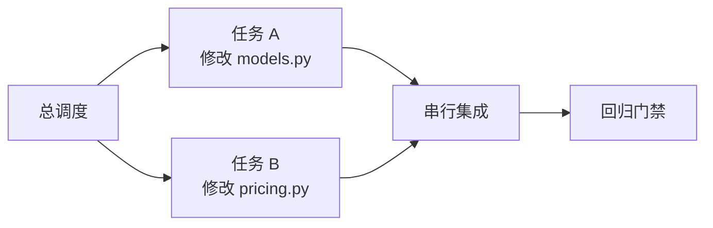
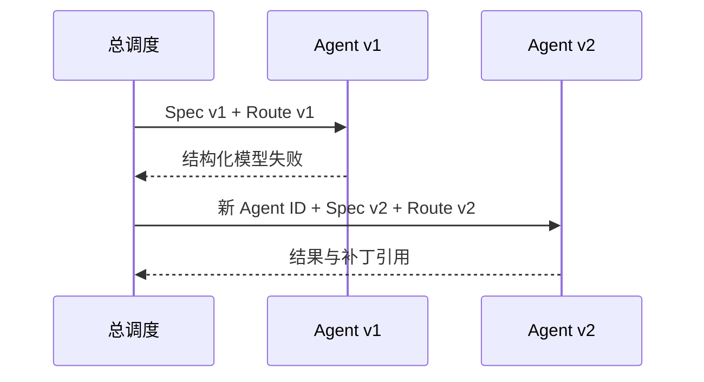

# EvoWeave 运行时拓扑与任务图

> 状态：阶段 7 架构基线
> 更新日期：2026-08-14

## 1. 核心结论

EvoWeave 不是固定角色工作流。系统只常驻一个总调度器，其他 Agent 都是根据当前需求、固定 commit 的仓库证据和已完成任务结果临时创建的通用执行实例。

Agent 数量、任务关系、模型档位和图片分配是四个独立决策：

- Agent 数量由可独立执行的写范围、依赖和并发价值决定；
- 任务关系由模块依赖与写集合冲突决定；
- 模型档位由难度、输入模态、上下文和能力硬约束决定；
- 原图只进入明确需要视觉证据的任务。

高难度不自动等于更多 Agent；有图片也不等于所有 Agent 都改用多模态模型。

## 2. 系统总拓扑

总调度只读取任务状态、结构化摘要、证据引用、风险、资源统计和失败分类。源码正文、完整终端日志、原图和 Worker 对话保留在执行层或产物层，避免总调度上下文持续膨胀。

## 3. 一次运行的数据边界

| 层级 | 主要数据 | 谁可以读取 | 用途 |
|---|---|---|---|
| L1 原始执行层 | 源码、图片、命令输出、工具轨迹 | 被授权的临时 Agent | 完成局部任务 |
| L2 任务结果层 | 补丁、测试摘要、证据引用、失败分类 | 归约器、集成和验证模块 | 形成可审查任务结果 |
| L3 控制层 | 状态、依赖、风险、进度指纹、产物 ID | 唯一总调度 | 创建、替换、取消或停止任务 |

临时 Agent 不能创建其他 Agent，也不能自行扩大工具、路径或模型权限。所有实例都使用同一个 Runtime，差异来自不可变的 `AgentExecutionSpec`，而不是固定角色类。

## 4. 动态任务图示例

### 4.1 串行依赖

价格接口先变化，结账服务再适配调用：

### 4.2 可并行修改

客户模型和价格规则互不依赖、写集合不重叠：

### 4.3 模型失败回退

回退不会覆盖旧执行记录，也不会让同一 Agent 在原地悄悄换模型。

## 5. 当前可行性证据与边界

阶段 6 已离线证明需求摄取、仓库画像、动态任务数、真实并发、依赖排序、模型回退、独立 worktree、补丁集成和真实 Pytest/Ruff 验证闭环。阶段 7 的冻结规划审计进一步覆盖 12 个任务：简单任务创建 1 个动态 Agent；两个图片相关任务分别只向必要实例提供原图；图片负例不暴露原图。

这些证据不能替代真实模型成功率。完整的 12 个任务 × 3 种 Agent 策略 × 3 种模型策略实验仍需由锁定版本的真实模型运行后才能形成效果结论。本机尚无 Docker CLI，真实不可信仓库执行仍不能宣称达到生产级隔离；单个模型调用被操作系统强制终止时也不承诺逐 Token 无重复恢复。
