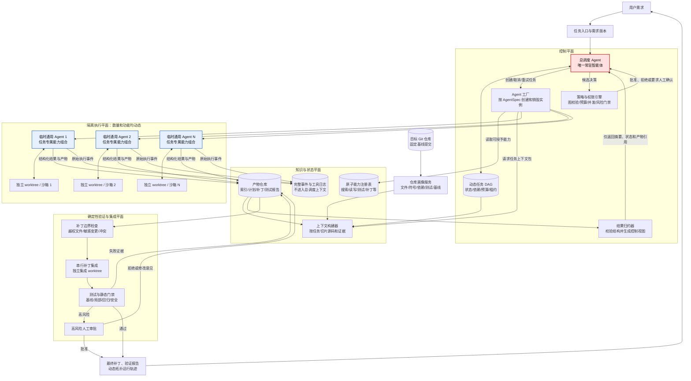

# 无固定角色的动态多智能体软件更新系统方案

> 方案对齐稿  
> 日期：2026-08-13  
> 当前阶段：只定义底层模型、边界与验证方式，暂不进入完整系统编码

## 技术结论

你的思路**可行，而且比“从预设角色池中选择若干角色”更有研究和项目展示价值**。不过需要把它转化成一个工程上可实现的定义：

> 系统中只有总调度 Agent 是常驻智能体；其余 Agent 都是由同一个通用执行内核在运行时临时创建的任务实例。系统不预设“产品经理、架构师、程序员、测试”等业务角色，而是为每个临时 Agent 动态装配任务目标、上下文、工具、权限、模型、预算、成功条件和输出协议。

因此，动态的不是一个角色名称，而是完整的 `AgentSpec`：

```text
临时 Agent 的实际功能
  = 当前任务目标
  + 被授予的原子工具
  + 可访问的上下文和产物
  + 文件与命令权限
  + 使用的模型和资源预算
  + 验收条件与结果格式
```

需要保留一个重要边界：**不预设业务角色是可行的，不预设任何底层能力则不可行。** 搜索、读取、编辑、运行测试、生成补丁等原子工具，以及权限策略、消息协议、沙箱和验证门禁必须预先实现。运行时可以动态组合这些能力，但不能凭空获得系统没有实现的工具或越过安全边界。

相较于上一版方案，本稿做出两项关键修正：

1. 不再让系统从 `solo / pipeline / fanout / hierarchical` 等预设协作模板中选型，而是让总调度 Agent **增量构造任务 DAG**，实际拓扑由任务依赖自然形成。
2. 不再把临时 Agent 称为 Navigator、Developer、Reviewer 等角色。定位、编码、验证只是一项任务在当次运行中的功能，不是 Agent 的永久身份。

最终建议是：**有条件采纳这个方向。** 先用技术尖峰证明“单一通用 Agent 内核可以被动态装配成不同功能”“总调度上下文确实与执行上下文隔离”“动态图能够安全扩缩”，再进入完整实现。

---

## 1. 我对你想法的正式理解

你的系统不是一个“动态挑选员工的软件公司”，而是一个“动态生成执行单元的软件变更控制系统”。它应满足以下定义：

| 维度 | 你的目标 | 本方案中的工程定义 |
|---|---|---|
| 常驻智能体 | 只有一个总 Agent | 只有 `Orchestrator` 长期保存控制上下文 |
| 业务角色 | 不提前定义 | 不存在产品经理、架构师、开发者等固定 Worker 类 |
| Agent 数量 | 随任务调整 | 根据待执行任务节点、独立性、风险和预算动态创建与销毁 |
| Agent 功能 | 随任务调整 | 通过 `AgentSpec` 动态组合工具、权限、上下文和输出协议 |
| Agent 关系 | 随任务调整 | 由任务 DAG 中的依赖、产物、验证和竞争关系实时形成 |
| 总 Agent 上下文 | 不读取所有执行过程 | 只接收结构化结果、状态、证据引用和预算数据 |
| 旧仓库更新 | 先读再改 | 先建立仓库画像和变更影响，再授予写权限 |
| 正确性 | 不能只信 Agent 自述 | 测试、静态检查、补丁约束和独立验证共同判定 |

### 1.1 “不设角色”不等于“所有 Agent 一模一样”

所有临时 Agent 使用同一个 `WorkerRuntime`，但每次实例化得到的能力不同。例如：

| 临时任务 | 动态上下文 | 动态工具 | 动态权限 | 输出 |
|---|---|---|---|---|
| 查找登录异常的影响范围 | 需求、仓库索引、相关符号 | 搜索、AST 查询、只读文件 | 禁止写文件和执行任意命令 | 候选文件、证据和置信度 |
| 修改认证模块 | 已确认的影响范围、接口约束、测试 | 读写、局部测试、差异检查 | 只允许写指定 worktree 和文件集合 | 补丁、测试结果和风险 |
| 验证补丁是否满足需求 | 需求验收项、集成补丁、测试清单 | 读文件、运行测试、静态分析 | 禁止修改源码 | 逐项验收结论 |

这三个实例没有固定角色类，也不需要继承 `NavigatorAgent`、`CoderAgent` 或 `ReviewerAgent`。它们只是同一内核在三个不同 `AgentSpec` 下的临时运行。

### 1.2 “功能动态生成”的准确边界

功能分为两层：

- **业务能力动态**：本次要定位、设计、编码、验证、排查失败还是解决冲突，由任务决定。
- **原子能力预置**：读取文件、搜索符号、编辑补丁、运行受限命令、执行测试等工具由系统提供。

系统可以动态决定“给哪个 Agent 哪些工具”，但不能让 Agent 自己获得未授权的工具。临时 Agent 可以在沙箱内编写一次性分析脚本，但这个脚本仍只能使用沙箱已授予的文件、网络和进程权限。

---

## 2. 结构总拓扑图

下面是系统完整拓扑。图中只有红色的总调度 Agent 是常驻 Agent；蓝色节点是按任务创建、完成后销毁的通用临时 Agent；其余方框都是确定性系统服务，不是预设业务角色。



### 2.1 拓扑阅读方式

这张图表达四个关键关系：

1. **总调度 Agent 不直接进入代码工作区。** 它操作的是任务图、状态、预算和 Agent 创建指令。
2. **临时 Agent 不直接互相聊天。** 一个 Agent 的结果进入产物仓库，依赖该结果的任务再获得相应上下文包。
3. **原始执行内容不上送总调度上下文。** 完整工具日志保存在事件仓库，结果归约器只生成控制决策需要的信息。
4. **Agent 不能自行宣布工作完成。** 补丁必须经过确定性边界检查、串行集成和测试门禁。

### 2.2 哪些是 Agent，哪些不是 Agent

这是本设计必须保持清晰的地方：

| 组件 | 是否 Agent | 是否常驻 | 说明 |
|---|---:|---:|---|
| 总调度 Agent | 是 | 是 | 负责拆任务、创建 Agent、读取结果、调整任务图 |
| 临时通用 Agent | 是 | 否 | 使用同一内核，能力由当次 `AgentSpec` 决定 |
| 仓库画像服务 | 否 | 是 | 用 Git、AST、搜索和测试命令机械采集仓库事实 |
| Agent 工厂 | 否 | 是 | 校验配置并启动隔离实例，不做语义判断 |
| 上下文构建器 | 否 | 是 | 按任务组织最小上下文包 |
| 策略与权限引擎 | 否 | 是 | 执行不可绕过的确定性限制 |
| 结果归约器 | 否 | 是 | 校验结果协议、截断自由文本、生成控制视图 |
| 补丁集成与测试门禁 | 否 | 是 | 用 Git 和测试结果判断是否接受产物 |

把机械能力做成服务而不是固定角色，不违反“不预设角色”的目标。相反，它能避免把任何普通程序都包装成 Agent，导致系统结构虚假复杂。

---

## 3. 系统启动时到底预设什么

### 3.1 必须预设的底层不变量

系统启动前只固定以下内容：

- 一个通用 `WorkerRuntime`，负责模型—工具—观察循环；
- 一个总调度 Agent 的控制协议；
- 原子能力注册表及每项能力的权限说明；
- `AgentSpec`、`TaskResult`、`ArtifactRef` 等数据协议；
- 动态任务 DAG 的合法性规则；
- 沙箱、worktree、预算、并发和人工审批规则；
- 补丁检查、测试、集成和审计机制。

这些是操作系统的“内核和系统调用”，不是预设的“员工角色”。

### 3.2 不在启动时预设的内容

以下内容只能在收到需求并分析仓库后产生：

- 需要创建多少个临时 Agent；
- 每个 Agent 要解决什么问题；
- 每个 Agent 使用哪些工具和模型；
- 每个 Agent 可以看到哪些源码和历史产物；
- 每个 Agent 可以修改哪些文件；
- Agent 之间是串行、并行、竞争验证还是汇合；
- 哪些 Agent 应被取消、重试、替换或补充；
- 整个任务何时收敛并停止。

### 3.3 不建议预设 Worker 子类

第一版不应出现下面这样的业务类层次：

```text
BaseAgent
 ├─ PlannerAgent
 ├─ DeveloperAgent
 ├─ TestAgent
 └─ ReviewAgent
```

应改为：

```text
WorkerRuntime + AgentSpec(task, tools, context, permissions, budget, output)
```

可以为了 UI 展示给某个实例生成临时标签，例如“认证模块影响分析”，但该标签不能决定代码类、固定提示词或永久工具集。

---

## 4. Agent 的功能如何在运行时形成

### 4.1 `AgentSpec` 是动态功能的唯一来源

建议把每个临时 Agent 的配置定义为强类型对象：

```python
class AgentSpec(BaseModel):
    agent_id: str
    task_id: str
    objective: str
    acceptance_criteria: list[str]

    input_artifacts: list[ArtifactRef]
    context_policy: ContextPolicy

    granted_tools: list[str]
    read_scope: list[str]
    write_scope: list[str]
    command_policy: CommandPolicy

    model_profile: ModelProfile
    token_budget: int
    time_budget_seconds: int
    max_steps: int

    output_schema: str
    base_commit: str
```

一个 Agent 的功能不由 `role="developer"` 决定，而由以上字段共同决定。

### 4.2 动态装配的六个维度

| 维度 | 总调度 Agent 的选择 | 示例 |
|---|---|---|
| 任务 | 这个实例唯一要完成的目标 | 找到导致缓存失效的代码路径 |
| 上下文 | 允许看到哪些源码和上游产物 | 只给缓存模块、调用图和复现日志 |
| 工具 | 可调用哪些原子能力 | 搜索、读文件、AST 查询，不给写工具 |
| 权限 | 工具能作用于什么范围 | 只能写 `src/cache/**` 和对应测试 |
| 资源 | 使用什么模型、Token、时间和步数 | 高不确定性分析使用强模型，机械验证使用小模型或程序 |
| 输出 | 必须返回何种结构 | 根因假设、证据、候选文件、置信度 |

### 4.3 能力升级必须重新授权

临时 Agent 在运行中发现能力不足时，不能自行增加权限。它只能返回：

```text
status = NEED_CAPABILITY
requested_capability = "运行数据库迁移测试"
reason = "仅靠静态阅读无法验证兼容性"
expected_benefit = "验证旧版本数据能否升级"
```

总调度 Agent 再决定：

- 给当前任务创建一个拥有新能力的替代实例；
- 新建一个独立验证任务；
- 请求人工审批；
- 因风险或预算拒绝请求。

为了复现和审计，已开始运行的 `AgentSpec` 原则上保持不可变。需要改变工具、权限或主要上下文时，应产生新版本并重新创建实例。

---

## 5. 总调度 Agent 如何避免上下文污染

### 5.1 四级信息隔离

建议把运行信息分为四级：

| 级别 | 内容 | 保存位置 | 总调度 Agent 默认是否读取 |
|---|---|---|---:|
| L0 | 私有推理过程 | 不要求上传，也不作为系统协议 | 否 |
| L1 | 工具调用、终端日志、读取过的源码片段 | 完整事件仓库 | 否 |
| L2 | 补丁、测试报告、影响分析等任务产物 | 产物仓库 | 只读取元数据和引用 |
| L3 | 状态、结论摘要、证据引用、风险和下一步请求 | 总调度控制视图 | 是 |

总调度 Agent 的上下文中不应出现所有 Worker 的对话、完整源码、长终端输出或逐步思考。它只需要回答控制问题：任务是否成功、结果是否可信、下一步依赖是否满足、是否要增加或减少 Agent、预算是否允许继续。

### 5.2 临时 Agent 的统一结果协议

每个实例结束时只能向控制平面提交结构化结果：

```python
class TaskResult(BaseModel):
    task_id: str
    agent_id: str
    status: Literal[
        "SUCCEEDED",
        "FAILED",
        "BLOCKED",
        "NEED_CAPABILITY",
        "NEED_DECOMPOSITION"
    ]

    conclusion: str                 # 有长度上限的短结论
    acceptance_checks: list[CheckResult]
    artifact_refs: list[ArtifactRef]
    evidence_refs: list[EvidenceRef]
    confidence: float
    risks: list[RiskItem]
    suggested_next_tasks: list[TaskProposal]
    resource_usage: ResourceUsage
```

总调度 Agent 可以接受或拒绝 `suggested_next_tasks`，但临时 Agent 自己不能直接创建其他 Agent。这保证系统只有一个创建入口，不会出现无控制的递归繁殖。

### 5.3 结果归约器不是另一个总 Agent

结果归约器主要做确定性处理：

- 校验 JSON Schema；
- 将测试日志转换为通过数、失败数和日志引用；
- 将补丁转换为文件列表、增删行和风险标签；
- 截断或拒绝超长自由文本；
- 把临时 Agent 的建议标记为“不可信提案”，而不是系统指令；
- 生成适合加入总调度上下文的 L3 控制视图。

如果原始失败日志过于复杂，不让总调度 Agent 亲自读取全部日志，而是创建一个新的“诊断任务”，把日志引用交给临时 Agent，再由该实例返回结构化诊断结果。

### 5.4 防止结果消息反向污染总调度 Agent

仓库源码、Issue 文本和 Worker 结果都属于不可信数据。需要采取以下措施：

- 结果中的自然语言只放在明确的数据字段，不拼接成系统指令；
- 总调度 Agent 不能因结果文本而修改权限策略；
- 工具、权限和预算变更必须经过策略引擎二次校验；
- 关键事实必须带 `EvidenceRef`，不能只有口头结论；
- “测试已通过”必须由门禁服务读取真实退出码，而不是相信 Agent 自述。

---

## 6. Agent 数量和关系如何真正动态变化

### 6.1 数量来自待执行任务，不来自角色清单

系统不计算“这个项目需要两个程序员和一个测试员”，而计算当前有多少个值得独立执行的任务节点。

某一时刻允许并行的 Agent 数量可以表示为：

```text
当前实例数
  = min(
      已就绪且相互独立的任务数，
      无写入冲突的任务数，
      预算允许的并发数，
      系统资源上限
    )
```

代码量只能作为执行成本的弱特征。真正影响拆分的是模块边界、依赖关系、任务耦合、风险、定位置信度和可验证性。

### 6.2 何时创建新的 Agent

总调度 Agent只在出现以下情况时增加实例：

- 已发现两个或以上输入、写集合和验收条件可以分离的子任务；
- 同一个高不确定性问题值得并行验证多个互斥假设；
- 需要独立证据验证某个补丁，而不能由原实例自证；
- 某任务失败，但改变上下文、工具、模型或策略后值得重试；
- 集成失败暴露了一个原任务中没有发现的新问题。

### 6.3 何时减少或取消 Agent

- 两个任务最终指向同一核心文件或同一状态变量，应取消并行并重新合并任务；
- 上游结论使某条假设分支失效，应立即取消对应实例；
- 预算边际收益低于阈值时，不继续扩张；
- 某个实例越界、超时、重复失败或长期无新证据时，应终止；
- 已有产物满足后续任务输入时，不再创建重复分析实例。

### 6.4 Agent 之间不是“职位关系”，而是任务关系

动态图中只需要以下关系：

| 关系 | 含义 | 示例 |
|---|---|---|
| `depends_on` | 下游必须等待上游产物 | 补丁任务等待影响范围确认 |
| `produces_for` | 一个任务生成另一个任务的输入 | 复现任务生成失败测试 |
| `validates` | 独立检查另一个产物 | 新任务验证补丁是否覆盖验收项 |
| `competes_with` | 多个任务验证互斥假设 | 两个实例分别调查缓存和数据库假设 |
| `merges_with` | 多个独立补丁需要汇合 | API 与存储模块补丁进入集成节点 |
| `supersedes` | 新任务替代失败或过时任务 | 新上下文重试替代旧实例 |

这些关系形成 DAG。它有时看起来像流水线，有时像星形、树形或并行汇合图，但系统不需要先给拓扑命名。

### 6.5 图是动态的，但不是不受约束的

总调度 Agent 可以提出任意任务节点和边，策略引擎必须拒绝以下非法图：

- 出现无法解释的循环依赖；
- 一个任务没有明确目标、输入或验收条件；
- 两个并行写任务的文件或符号写集合冲突；
- Agent 数量、Token、时间或容器资源超过上限；
- 普通任务请求高风险命令或访问主工作区；
- 未通过上游门禁就进入合并或交付；
- 临时 Agent 试图直接创建新 Agent 或修改任务图。

这意味着：**拓扑形状由智能体动态决定，拓扑合法性由程序确定性决定。**

---

## 7. 总调度 Agent 的运行循环

总调度 Agent 不执行源码任务，它只执行控制循环：

```text
读取用户目标和当前控制视图
        ↓
判断当前缺少什么可验证信息或产物
        ↓
创建、拆分、取消、重试或等待任务
        ↓
为每个任务生成 AgentSpec
        ↓
策略引擎校验图、权限和预算
        ↓
Agent 工厂启动临时实例
        ↓
只接收 TaskResult 和门禁状态
        ↓
更新任务 DAG，决定下一轮动作
        ↓
所有验收项满足后停止并输出结果
```

其决策动作应限制为一个有限集合：

```python
Decision = Literal[
    "CREATE_TASK",
    "DECOMPOSE_TASK",
    "CANCEL_TASK",
    "RETRY_TASK",
    "REQUEST_VERIFICATION",
    "REQUEST_HUMAN_APPROVAL",
    "WAIT",
    "FINISH"
]
```

限制决策动作不会限制任务内容的动态性，反而能让控制过程可恢复、可测试、可回放。

### 7.1 第一次如何启动

总调度 Agent 在尚不了解仓库时不应猜测团队结构。启动顺序是：

1. 仓库画像服务机械采集语言、目录、符号、依赖、测试和基线状态。
2. 总调度 Agent 读取轻量仓库摘要和用户需求。
3. 如果证据已足够，直接创建一个最小执行任务。
4. 如果证据不足，创建一个或多个只读探索任务；这些仍是通用临时 Agent，不是预设的“分析师角色”。
5. 探索结果返回后，总调度 Agent 再生成后续任务和关系。

因此，系统不需要在运行前知道最终有几个 Agent。最初可能只有一个探索实例，任务展开后增加到三个，假设被排除后又缩减为一个。

---

## 8. 一个具体运行示例

假设用户提出：

> 在现有 Python 电商项目中，为订单取消增加库存回补，并保证重复取消不会重复增加库存。

系统可能形成以下过程，但这不是预设流程：

### 第一步：总调度创建探索任务

动态创建实例 A：

- 目标：定位订单状态变更、库存写入和重复请求处理路径；
- 工具：搜索、AST、只读文件、测试枚举；
- 权限：不可写、不可安装依赖；
- 输出：候选符号、调用关系、风险、建议任务。

### 第二步：结果触发任务图扩展

A 返回证据：订单取消和库存服务位于两个模块，数据库事务跨越二者，且已有幂等键机制。总调度据此创建：

- 实例 B：生成失败复现测试，只能写测试目录；
- 实例 C：设计最小变更方案，只读；
- B 与 C 可以并行，因为没有源码写冲突。

### 第三步：动态收缩和重新装配

C 发现库存回补必须复用既有幂等服务，不需要分别修改两个独立模块。总调度放弃原本可能的双编码并行，只创建实例 D：

- 输入：B 的复现测试、C 的设计产物、相关源码切片；
- 工具：搜索、读写、局部测试、diff；
- 写权限：订单服务、库存服务和对应测试；
- 输出：单一补丁及验收报告。

### 第四步：独立验证

D 的补丁通过局部测试后，总调度创建实例 E：

- 输入：需求、验收项、补丁引用、集成测试结果；
- 权限：只读；
- 目标：寻找重复取消、事务回滚和并发场景的遗漏。

如果 E 找到遗漏，总调度创建新的修复任务；如果没有，确定性门禁完成回归测试并交付。

本次运行的 Agent 数量是由结果逐渐长出来的，不是启动前决定为“五个角色”。如果第一步就发现只是单文件分支判断错误，系统也可能只使用一个临时 Agent。

---

## 9. 与 MetaGPT 的本质差异

| 维度 | MetaGPT 的主要思想 | 本方案 |
|---|---|---|
| 组织单位 | 带身份、目标和 Action 的 Role | 无业务身份的临时任务实例 |
| Worker 来源 | 入口预先雇佣一组角色 | 总调度按需创建同一通用内核的实例 |
| 能力配置 | 通常随 Role 类和 Action 集合配置 | 每个任务通过 `AgentSpec` 临时组合 |
| Agent 数量 | 主要由团队配置决定 | 由动态图中的就绪任务和资源限制决定 |
| 协作方式 | Message 在角色和环境之间路由 | 任务依赖和版本化产物流转 |
| 拓扑形成 | 在已有角色集合中路由或执行 SOP | 根据中间结果增量扩展、裁剪任务 DAG |
| 总控上下文 | TeamLeader 可接收并路由角色消息 | 总调度只读取 L3 控制视图，不接收完整过程 |
| 写代码隔离 | 默认路径不以每 Agent 独立 worktree 为核心 | 每个写实例必须使用独立 worktree 和沙箱 |
| 完成判定 | Role 输出和流程推进 | 强类型结果 + 确定性验证门禁 |

我们的创新点不应该表述为“MetaGPT 加一个动态角色选择器”，而应该表述为：

> 将软件变更过程建模为一个由单一总调度 Agent 持续生成和修正的任务图，并通过任务级能力装配创建无固定业务角色的临时 Agent。

---

## 10. 可行性与主要难点

### 10.1 分层判断

| 能力 | 可行性 | 主要原因 |
|---|---:|---|
| 运行时创建任意数量的同构 Agent | 高 | 本质是创建独立 Runtime、会话和沙箱 |
| 按任务动态装配工具、上下文和权限 | 高 | 可由强类型配置和能力注册表实现 |
| 总调度与执行上下文隔离 | 高 | 通过事件仓库、产物引用和结果协议即可实现 |
| 动态增加、取消和替换任务节点 | 高 | 持久化 DAG 和状态机机制成熟 |
| 根据仓库和需求做可靠任务拆分 | 中 | 依赖仓库理解、影响分析和 LLM 判断质量 |
| 自动判断并行写入是否安全 | 中 | 文件集合可判断，深层语义耦合较难发现 |
| 让 Agent 凭空创造系统没有的真实工具 | 不可行 | 模型不能产生宿主系统未提供的权限和接口 |
| 完全无规则地生成任意拓扑并可靠收敛 | 低 | 容易循环、爆炸、浪费预算和产生冲突 |

### 10.2 最大风险和解决方式

**风险一：总调度 Agent 因摘要过短而误判。** 解决方式不是把原始内容全部塞回去，而是允许它创建定向诊断任务，或请求某个具体产物的受控摘要。

**风险二：临时 Agent 的结果看似合理但没有事实依据。** 所有关键结论都必须引用文件、符号、补丁、退出码或测试产物；门禁状态由系统服务生成。

**风险三：动态能力变成动态提权。** `AgentSpec` 只能从能力注册表中选择工具，策略引擎对写路径、命令、网络、密钥和资源进行不可绕过的校验。

**风险四：总调度不断创建 Agent，成本失控。** 设全局预算、最大并发、最大图节点、单任务重试次数和“新增 Agent 的预期收益”字段；简单任务默认从一个实例开始。

**风险五：动态图无法停止。** 完成条件必须来自用户需求的验收项；同时设置无进展检测、重复任务检测、深度限制和人工中止点。

**风险六：不同实例产生互相冲突的补丁。** 所有写实例使用独立 worktree，声明写集合；只有确定性集成服务可以向集成分支应用补丁。

**风险七：总调度成为单点故障。** 它的决定、任务图和预算都持久化；模型调用失败后可以从最近检查点重试，不能只保存在一段对话里。

---

## 11. 编码前必须证明的四件事

现在不应直接建设完整平台。建议先做四个互相独立的技术尖峰。

### 尖峰一：一个内核能否承担不同功能

只实现一个 `WorkerRuntime`，不建立任何业务 Agent 子类。用三份不同 `AgentSpec` 让它分别完成：

- 只读定位；
- 受限源码修改；
- 只读补丁验证。

通过标准：三个任务都由同一个 Runtime 类完成；工具、写权限、上下文和输出格式确实随配置变化；越权操作被系统拒绝。

### 尖峰二：总调度上下文是否真正隔离

准备一个包含大量源码、工具调用和长测试日志的任务。验证：

- 原始日志只进入事件仓库；
- 总调度只收到结构化 L3 控制视图；
- 总调度能根据失败状态创建诊断任务；
- 诊断完成后仍不需要读取完整原始日志；
- 每个调度决策都能追溯到结果和证据引用。

### 尖峰三：动态图能否安全扩缩

准备一个先不确定、后发现可并行、再发现其中两项耦合的任务。系统应完成：

1. 从一个探索实例启动；
2. 动态扩张到多个任务；
3. 对无冲突任务并行；
4. 发现写集合重叠后取消或合并任务；
5. 在独立 worktree 中生成补丁并串行集成；
6. 最终任务图无循环、无孤儿任务、无失控实例。

### 尖峰四：动态系统是否优于简单系统

至少选取 12 个 Python 旧仓库变更任务，对比：

1. 单一 Agent 完成全部工作；
2. 固定数量和固定流程的多 Agent；
3. 本方案的动态任务图和动态能力装配。

记录成功率、定位准确率、测试通过率、Token、时延、创建实例数、冲突次数和无效任务比例。只有动态方案在复杂任务成功率或总体成本上体现稳定收益，才能把“动态”作为经过验证的项目亮点。

---

## 12. 第一版应冻结的边界

为了把项目做成一个确实可运行、可演示、可答辩的秋招项目，第一版建议固定以下边界：

- 先只支持 Python 仓库；
- 只有总调度 Agent 可以创建、取消或重试临时 Agent；
- 所有临时 Agent 使用同一个通用 Runtime；
- 不预设任何业务角色类和固定团队；
- 动态能力只能从已注册原子工具中组合；
- 普通 Agent 之间不直接自由聊天，只通过版本化产物流转；
- 所有写任务都在独立 Git worktree 和容器中执行；
- 总调度默认不读取原始源码、工具轨迹或长日志；
- 任务图可以动态变化，但必须通过确定性合法性校验；
- 测试和集成门禁不是 Agent，且不能被 Agent 的文字结论替代；
- 不自动提交、推送或合并到用户主分支；
- 高风险依赖、认证、权限、数据库迁移和网络操作要求人工批准。

这些限制不会削弱“动态 Agent”亮点，反而会把亮点从提示词表演转化为可审计的系统设计。

---

## 13. 我们目前需要对齐的结论

如果采纳本稿，那么项目的核心共识应是：

1. **只有一个常驻总调度 Agent。**
2. **不存在预设的业务 Worker 角色。**
3. **所有临时 Agent 来自同一个通用执行内核。**
4. **Agent 的功能由任务级 `AgentSpec` 动态装配，而不是由角色名决定。**
5. **Agent 数量等于当前值得独立执行的任务实例数，不与代码行数直接对应。**
6. **Agent 关系是产物和依赖关系，不是职位汇报关系。**
7. **总调度只读结构化结果和产物引用，不读所有运行内容。**
8. **拓扑由总调度增量生成，但安全、预算和图合法性由确定性程序约束。**
9. **临时 Agent 不能创建临时 Agent，也不能自行扩大权限。**
10. **系统依赖测试和集成门禁判断完成，不能相信 Agent 自证。**

如果以上十点成立，我们就不再沿用“MetaGPT 的动态角色版本”这个描述。更准确的项目名称和定位是：

> **面向旧仓库软件更新的无固定角色、自适应任务图多智能体控制系统。**

---

## 14. 推荐的下一步

下一步仍然不是直接写完整系统，而是先冻结三个最底层协议：

1. `AgentSpec`：总调度到底能给临时 Agent 配置什么；
2. `TaskResult`：总调度到底能从临时 Agent 看到什么；
3. `GraphPolicy`：动态图允许如何扩张、并行、重试和停止。

这三个协议一旦确定，才能判断底层应选用 OpenHands SDK、mini-SWE 风格自研 Runtime，还是两者同时通过适配器接入。框架选型应服从协议，而不能反过来让框架定义我们的系统。

---

## 附录：本方案与既有调研的关系

本稿建立在前一轮已完成的 MetaGPT 与多 Agent 项目源码调研之上，重点不是重复列举项目，而是根据你的新约束修改架构结论：

- MetaGPT 的 `Role / Action / Message / Environment` 适合作为协作抽象参考，但其预先创建业务角色的主路径不作为本方案组织模型；
- OpenHands Software Agent SDK 和 mini-SWE-agent 可作为通用 Worker 内核候选，但不能接管我们的动态任务图控制平面；
- LangGraph 一类持久化图运行时可用于保存状态和恢复执行，但任务节点及其关系必须由我们的总调度逻辑产生；
- Git worktree、容器、补丁产物和确定性测试继续作为多实例写代码的执行安全底座。

相关公开项目：

- [MetaGPT](https://github.com/FoundationAgents/MetaGPT)
- [OpenHands Software Agent SDK](https://github.com/OpenHands/software-agent-sdk)
- [mini-SWE-agent](https://github.com/SWE-agent/mini-swe-agent)
- [LangGraph](https://github.com/langchain-ai/langgraph)
